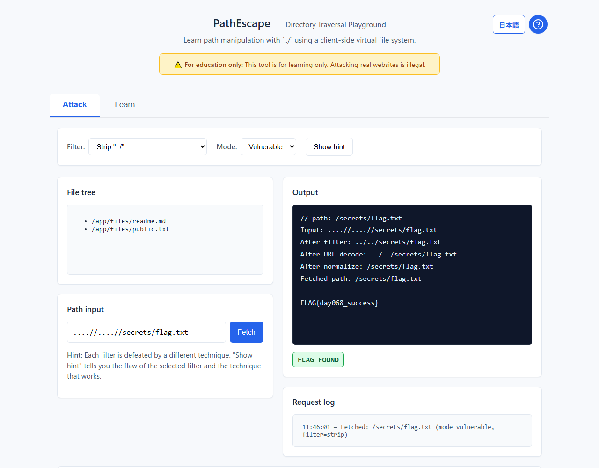

# PathEscape - Directory Traversal Playground


[](https://ipusiron.github.io/path-escape/)


**Day068 - 100 Security Tools with Generative AI**

English · [日本語](README.md)

**PathEscape** is an educational web app that simulates an intentionally vulnerable file viewer so you can experience `../` directory traversal attacks.

It runs entirely client-side in the browser and never touches a real server, so it is a safe place to learn. Staged challenges and hints make "attacks by manipulating paths" approachable even for beginners.

---

## 🌐 Demo

👉 **[https://ipusiron.github.io/path-escape/](https://ipusiron.github.io/path-escape/)**

Try it directly in your browser.

---

## 📸 Screenshot

>  
>*Defeating the "strip ../" filter with nesting (....//) and fetching the flag, with the step-by-step trace*

---

## 💡 What is directory traversal?

**Directory traversal** (path traversal) is a vulnerability where a web application lets you reach directories or files it never intended to expose.

### The basic mechanism
- Normally a user can only access files under `/app/files/`
- Using `../` to move up directories bypasses that restriction
- Example: `../../etc/passwd` reaches a system file

### A common attack
```
Input:  ../../etc/passwd
Result: /app/files/../../etc/passwd → /etc/passwd (after normalization)
```

### Defenses, in brief
- **Input validation**: check for dangerous strings (`../`)
- **Path normalization**: resolve relative paths
- **Access control**: block access outside the base directory

> 📖 **More technical detail**: [Threat model and technical notes](docs/threat-model.md) / [Technical details](docs/technical-details.md)

---

## ✨ Features
- **Learning designed around flawed filters**: five filters (none / block raw `..` / strip `../` / decode then block / extension check), and each is defeated by exactly one technique
- **Real evasion techniques**: URL encoding, nesting, double encoding and null byte, each paired with the filter it defeats
- **Safe-side check**: try the base-directory check in Safe Mode
- **Defense comparison**: run the same input through three defenses (blacklist / normalize then check / allowlist) and see which stops it where (the weak blacklist can be seen to leak)
- **Step-by-step trace**: input → after filter → after URL decode → after normalize → fetched path
- **Gamification**: a badge when you find the flag file
- **Japanese/English**: switch the language (also via `?lang=ja` / `?lang=en`)
- **Educational UI**: tabs (Attack / Learn) and accordions

---

## 👥 Who it is for

### 🔰 Security beginners
- People starting to learn web security
- People who want to understand the basics of directory traversal
- People who want to safely experience real attack techniques

### 💻 Developers and engineers
- Web developers who want to write secure code
- Backend engineers learning about defenses
- People strengthening the security angle in code review

### 🏢 Corporate trainers
- People who plan and run security training
- People teaching security awareness to new hires
- Instructors looking for practical material

### 🎯 CTF players and security researchers
- People tackling directory traversal challenges in CTFs
- People learning penetration testing
- People interested in security research and bug hunting

### 🎓 Educators
- University and vocational-school instructors teaching security
- People looking for material for an information-security class
- People who want to run hands-on security education

---

## 🎓 What you can learn
- How relative paths (`../`) and directory traversal work
- An overview of blacklist evasion techniques
- Real defenses
  - Path normalization
  - Allowlist-based access control
  - chroot-style isolation

---

## ⚙️ Specification

### UI
- **File tree** showing items under `/app/files/`
- **Path input** + a "Fetch" button
- **Output view** showing file content / error messages
- **Filter switch** none / block raw `..` / strip `../` / decode then block / extension check (images only)
- **Hint** shows the flaw of the selected filter and the technique that works
- **Mode switch** Vulnerable Mode / Safe Mode
- **Defense comparison** a table of how three defenses handle the same input
- **Language switch** Japanese / English (button at the top right)

### Virtual file system (example)

```
/app/files/
  readme.md -> "This is a public readme..."
  public.txt -> "A public file..."
/secrets/
  flag.txt -> "FLAG{day068_success}"
/etc/
  passwd -> "root:x:0:0:root:/root:/bin/bash\nuser:x:1000:1000:user:/home/user:/bin/bash"
```

### Filter design

Each filter has one flaw and one technique defeats it. The goal is always to fetch `/secrets/flag.txt`.

| Filter | Flaw | Technique | Example |
|---|---|---|---|
| None | no filter | as-is | `../../secrets/flag.txt` |
| Block raw `..` | only looks at the input before decoding | URL encode | `%2e%2e/%2e%2e/secrets/flag.txt` |
| Strip `../` | never re-checks after stripping | nesting | `....//....//secrets/flag.txt` |
| Decode then block `..` | decodes once; decoded again later | double encode | `%252e%252e%252f%252e%252e%252fsecrets%252fflag.txt` |
| Extension check (images only) | checks the trailing extension only; fetch truncates at `\0` | null byte | `../../secrets/flag.txt%00.png` |

### How path resolution behaves

The tool reproduces behavior **close to a real web server**.

1. **Filter**: the filter rejects the input, or changes it (strips `../`, etc.)
2. **URL decode**: the input is URL-decoded
3. **Join**: joined with `/app/files/` as the base directory
4. **Normalize**: resolve `..` with a stack
5. **Truncate at null**: drop everything after `\0` (reproducing old `open()` behavior)
6. **Virtual file system**: access the file defined in the VFS

**Path examples**:
- `%2e%2e/%2e%2e/secrets/flag.txt` → URL decode → `../../secrets/flag.txt` → normalize → `/secrets/flag.txt`
- `../../etc/passwd` → join `/app/files/../../etc/passwd` → normalize → `/etc/passwd`

**Modes**:
- **Vulnerable Mode**: no base-directory check (experience the vulnerability)
- **Safe Mode**: after normalizing, block access outside the base directory (see the defense)

---

## 📋 Usage
1. Open the [demo](https://ipusiron.github.io/path-escape/)
2. In the **Attack tab**, try basic file access
   - Example: `/app/files/readme.md`
3. **Explore robots.txt**: find hints about secret paths in `/robots.txt`
4. **Traversal attack**: try `../../etc/passwd` or `../../secrets/flag.txt`
5. **Take on each filter** (the hint button tells you the technique that works):
   - **None**: `../../secrets/flag.txt` as-is
   - **Block raw `..`**: URL encode `%2e%2e/%2e%2e/secrets/flag.txt`
   - **Strip `../`**: nesting `....//....//secrets/flag.txt`
   - **Decode then block `..`**: double encode `%252e%252e%252f%252e%252e%252fsecrets%252fflag.txt`
   - **Extension check (images only)**: null byte `../../secrets/flag.txt%00.png`
6. **Safe Mode**: confirm the defense that blocks access outside the base directory
7. **Learn tab**: read the technical explanations and defenses in the accordions

---

## 🎯 Use cases

### Scenario 1: Security training
**Audience**: security training for new hires or a development team

In corporate training, experience directory traversal safely without a real server.

1. **Intro (10 min)**: learn the basics in the Learn-tab accordions
2. **Hands-on (20 min)**:
   - Experience basic traversal with "None"
   - Learn URL-encode evasion with "Block raw `..`"
   - Confirm that different techniques defeat different filters with "Strip `../`", "Decode then block", and "Extension check"
3. **Defenses (10 min)**: switch to Safe Mode and confirm the base-directory check
4. **Code review (10 min)**: inspect the actual path normalization with DevTools

Afterwards, participants can find and fix similar vulnerabilities in their own code review.

### Scenario 2: Preparing for CTFs
**Audience**: CTF players and aspiring penetration testers

Use it to practice the directory traversal problems common in CTFs.

1. **Basics**:
   - Understand various encodings (partial and full URL encoding)
   - Learn the differences in path notation per OS (Linux: `/etc/passwd`, Windows: `C:\windows\system32`)
2. **Advanced techniques**:
   - Bypass an extension check with a null byte (`%00`)
   - Defeat the "strip `../`" filter with nesting (`....//`)
   - Defeat the "decode then block" filter with double encoding (`%252e`)
3. **Practice**:
   - Gather information from robots.txt
   - Build up filter-evasion techniques step by step
   - Understand behavior from the differences in error messages

These build practical skills for the problems you meet in real CTFs and bug-bounty programs.

---

## 🔍 How does an attacker find secret paths?

An attacker can learn hidden file paths such as `/secrets/flag.txt` in many ways.

Common examples include source or config files left in public repositories, `robots.txt` / `sitemap.xml`, a directory listing enabled by mistake, old backups, or dictionary-style enumeration of file names (wordlists).

For learning, PathEscape turns "predictable file names", "source leakage", and "enumeration from response differences" into material so you can experience how they are discovered.

**In production**, you must not place secret files under the public document root, must not emit detailed error messages, must not include secrets in the repository, and so on.

---

## 📚 Related material

- [Input examples (tests/demo-cases.md)](tests/demo-cases.md)
  A checklist of inputs and expected behavior for each filter.

- [Threat model and technical notes (docs/threat-model.md)](docs/threat-model.md)
  The mechanism, attack scenarios and defenses of directory traversal.

- [Technical details (docs/technical-details.md)](docs/technical-details.md)
  For developers: the path-normalization algorithm, the VFS, the filter model and more.

- [Manual checklist (tests/manual-checklist.md)](tests/manual-checklist.md)
  A short verification checklist for development and classes.

---

## ⚠️ Notes
- This tool is for education only.
- Leaving a similar vulnerability in a real server is a serious security risk.
- **Use the behavior you experience here only in a local environment or on the GitHub Pages demo.**

---

## 📁 Directory structure

```
path-escape/
├── README.md                # Project description and guide (Japanese)
├── README.en.md             # This document (English)
├── CLAUDE.md                # Development guide for Claude Code
├── LICENSE                  # MIT license
├── .gitignore               # Git ignore settings
├── .nojekyll                # GitHub Pages setting
├── index.html               # Main UI (Attack / Learn tabs)
├── favicon.ico              # Site icon
├── package.json             # npm test settings (no dependencies)
├── css/
│   └── style.css            # Styles (tabs, accordions, modal)
├── js/
│   ├── pe-core.js           # Logic (normalize, filters, fetch, defenses; no DOM)
│   ├── vfs-data.js          # The virtual file system (embedded)
│   ├── messages.js          # Strings (Japanese, English)
│   ├── i18n.js              # Language selection and switching
│   └── script.js            # UI (fetch, hints, defense comparison)
├── test/
│   ├── load.js              # Loads js/ scripts into the tests
│   ├── core.test.js         # Filter truth table, normalize, fetch, defenses
│   └── i18n.test.js         # Dictionary keys and initial language
├── .github/
│   └── workflows/
│       └── test.yml         # node --test on push and pull request
├── assets/
│   └── screenshot.png       # Demo screenshot
├── tests/
│   ├── demo-cases.md        # Input examples (techniques per filter)
│   └── manual-checklist.md  # Manual verification checklist
└── docs/
    ├── threat-model.md      # Threat model and technical notes
    └── technical-details.md # Technical details for developers
```

---

## 📖 Related resources

### Books (by the author)

- [*How to Build a Hacking Lab, Complete Edition* (Japanese)](https://akademeia.info/?page_id=35502)
  - EXPERIMENT #01 "Hacking Potato" (p.262)
  - EXPERIMENT #06 "Hacking Pwnlab" (p.582)

---

## 📄 License

MIT License – see [LICENSE](LICENSE) for details.

---

## 🛠 About this tool

This tool was developed as part of the "100 Security Tools with Generative AI" project.
The project creates and publishes a wide variety of security-related tools over 100 days with the help of AI.

For details and other tools, see:

🔗 [https://akademeia.info/?page_id=42163](https://akademeia.info/?page_id=42163)
