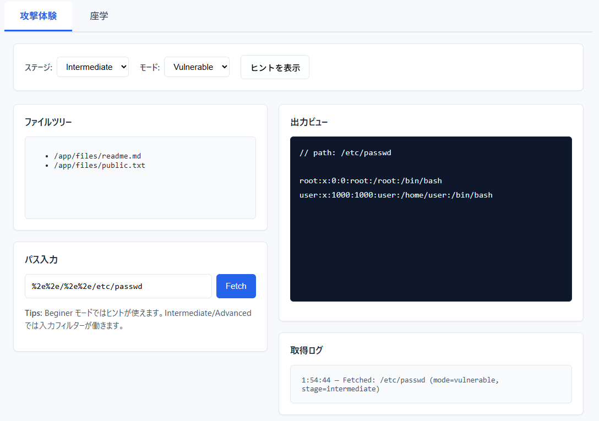

<!--
---
title: PathEscape
category: web-security
difficulty: 1
description: Hands-on directory traversal training app. Learn `../` path attacks and defenses through staged challenges, all client-side.
tags: [directory-traversal, web-security, demo, js, training]
demo: https://ipusiron.github.io/path-escape/
---
-->

# PathEscape - ディレクトリートラバーサル体験ツール


[](https://ipusiron.github.io/path-escape/)


**Day068 - 生成AIで作るセキュリティツール100**


**PathEscape** は、わざと脆弱なファイル閲覧機能をシミュレートし、`../` を使ったディレクトリートラバーサル攻撃を体験できる教育用Webアプリです。

ブラウザー上で完全に動作するクライアントサイドアプリケーションとして設計されており、実際のサーバーへのアクセスは一切行わない安全な学習環境を提供します。

初心者でも直感的に「パスの操作による攻撃」が理解できるよう、段階的なチャレンジとヒントを備えています。

---

## 🌐 デモページ

👉 **[https://ipusiron.github.io/path-escape/](https://ipusiron.github.io/path-escape/)**

ブラウザーで直接お試しいただけます。

---

## 📸 スクリーンショット

>  
>*入力フィルターを回避して"/etc/passwd"ファイルにアクセス*

---

## 💡 ディレクトリートラバーサルとは？

**ディレクトリートラバーサル**（パストラバーサル）は、Webアプリケーションが意図しないディレクトリーやファイルにアクセスできてしまう脆弱性です。

### 基本的な仕組み
- 通常、ユーザーは `/app/files/` 内のファイルのみアクセス可能
- `../` を使って上位ディレクトリーに移動することで、制限を回避
- 例: `../../etc/passwd` で システムファイルに到達

### よくある攻撃例
```
入力: ../../etc/passwd
結果: /app/files/../../etc/passwd → /etc/passwd (正規化後)
```

### 対策の基本
- **入力検証**: 危険な文字列（`../`）のチェック
- **パス正規化**: 相対パスを絶対パスに変換
- **アクセス制御**: ベースディレクトリー外へのアクセス禁止

> 📖 **詳細な技術解説**: [脅威モデルと技術解説](docs/threat-model.md) / [技術詳細ドキュメント](docs/technical-details.md)

---

## ✨ 特徴
- **段階的学習設計**: Beginner → Intermediate → Advanced の3ステージ
- **リアルな攻撃体験**: URLエンコード、混合エンコード、Null文字などの実際の回避手法
- **安全な対策確認**: Safe Mode でベースディレクトリーチェックによる防御を体験
- **ゲーミフィケーション**: フラグファイル発見でバッジ表示
- **教育的UI**: タブ形式（攻撃体験・座学）とアコーディオン形式の解説

---

## 👥 対象ユーザー

### 🔰 セキュリティ初学者
- Webセキュリティを学び始めたい方
- ディレクトリートラバーサルの基本概念を理解したい方
- 実際の攻撃手法を安全に体験したい方

### 💻 開発者・エンジニア
- セキュアなコードを書きたいWeb開発者
- 脆弱性対策を学びたいバックエンドエンジニア
- コードレビューでセキュリティ観点を強化したい方

### 🏢 企業研修担当者
- セキュリティ研修を企画・実施する方
- 新入社員にセキュリティ意識を教育したい方
- 実践的な教材を探している研修講師

### 🎯 CTF参加者・セキュリティ研究者
- CTFでディレクトリートラバーサル問題に挑戦する方
- ペネトレーションテストを学習中の方
- セキュリティ研究・バグハンティングに興味がある方

### 🎓 教育関係者
- セキュリティを教える大学教員・専門学校講師
- 情報セキュリティ授業の教材を探している方
- 実習型のセキュリティ教育を行いたい方

---

## 🎓 学習できること
- 相対パス (`../`) とディレクトリトラバーサルの仕組み
- ブラックリスト回避手法の概要
- 実際の対策方法
  - パス正規化
  - ホワイトリストベースのアクセス制御
  - chroot的隔離

---

## ⚙️ 仕様

### UI
- **ファイルツリー表示** `/app/files/` 以下をナビゲーション表示
- **パス入力フォーム** + 「Fetch」ボタン
- **出力ビュー** ファイル内容／エラーメッセージを表示
- **ステージ切替** Beginner / Intermediate / Advanced
- **ヒント機能** 段階的に表示
- **モード切替** Vulnerable Mode（脆弱挙動） / Safe Mode（対策実装）

### 仮想ファイルシステム例

```
/app/files/
  readme.md -> "This is a public readme..."
  public.txt -> "公開ファイルです..."
/secrets/
  flag.txt -> "FLAG{day068_success}"
/etc/
  passwd -> "root:x:0:0:root:/root:/bin/bash\nuser:x:1000:1000:user:/home/user:/bin/bash"
```

### ステージ設計
1. **Beginner**
   - フィルターなし、すべての攻撃手法が使える
   - 基本的なディレクトリートラバーサルから高度な手法まで練習可能
2. **Intermediate**
   - 生の入力で `..` をブロック（URLデコード前の単純チェック）
   - URLエンコード（部分・完全）で回避可能、高度な手法も使える
3. **Advanced**
   - URLデコード後の検証を含む高度なフィルター
   - 意図的な穴：ダブルスラッシュ、混合エンコード、Null文字等で回避可能
   - ブラックリストの限界とホワイトリストの重要性を学習

### パス解決の挙動について

本ツールでは、**実際のWebサーバーに近い挙動**を再現しています：

1. **URLデコード処理**: ユーザー入力は最初にURLデコードされます
2. **パス結合**: `/app/files` をベースディレクトリーとして結合
3. **正規化**: `normalizePath()` 関数で `..` を解決
4. **仮想ファイルシステム**: VFSで定義されたファイルへアクセス

**パス例**:
- `%2e%2e/%2e%2e/etc/passwd` → URLデコード → `../etc/passwd` → 正規化 → `/app/etc/passwd`
- `../../etc/passwd` → 正規化 → `/etc/passwd` ✓

**モード別の動作**:
- **Vulnerable Mode**: ベースディレクトリーチェックなし（脆弱性を体験）
- **Safe Mode**: ベースディレクトリー外へのアクセスをブロック（対策を確認）

---

## 📋 使い方
1. [デモページ](https://ipusiron.github.io/path-escape/) を開く
2. **攻撃体験タブ**で基本的なファイルアクセスを確認
   - 例: `/app/files/readme.md`
3. **robots.txtを探索**: `/robots.txt` で機密パスのヒントを発見
4. **ディレクトリートラバーサル攻撃**: `../../etc/passwd` や `../../secrets/flag.txt` を試す
5. **各ステージに挑戦**:
   - **Beginner**: フィルターなし、すべての攻撃手法が使用可能
   - **Intermediate**: 部分・完全URLエンコードで回避 (`%2e%2e/%2e%2e/etc/passwd`, `%2e%2e%2f%2e%2e%2fsecrets%2fflag.txt`)
   - **Advanced**: 高度な回避手法 (`..//..//etc/passwd`, `..././..././etc/passwd`, `..%2f..%2fetc%2fpasswd`)
6. **Safe Mode**: ベースディレクトリー外アクセスをブロックする防御機能を確認
7. **座学タブ**: アコーディオン形式で技術的な解説と対策を学習

---

## 🎯 利用シナリオ

### シナリオ1: セキュリティ研修での活用
**対象**: 新入社員や開発チーム向けのセキュリティ研修

企業のセキュリティ研修において、実際のサーバーを使わずに安全にディレクトリートラバーサル攻撃を体験できます。

1. **導入（10分）**: 座学タブのアコーディオンセクションで基本概念を学習
2. **実習（20分）**:
   - Beginnerモードで基本的な攻撃パターンを体験
   - IntermediateモードでURLエンコード回避手法を学習
   - Advancedモードで高度な回避テクニックを確認
3. **防御策の確認（10分）**: Safeモードに切り替えて、ベースディレクトリーチェックによる対策を確認
4. **コードレビュー（10分）**: DevToolsを使って実際のパス正規化処理を確認

研修後は、参加者が自社のコードレビューで同様の脆弱性を発見・修正できるようになります。

### シナリオ2: CTF・セキュリティコンテストの準備
**対象**: CTF参加者やペネトレーションテスター志望者

CTFでよく出題されるディレクトリトラバーサル問題の練習ツールとして活用できます。

1. **基礎トレーニング**:
   - さまざまなエンコーディング手法（部分・完全URLエンコード）の理解
   - OSごとのパス表記の違い（Linux: `/etc/passwd`、Windows: `C:\windows\system32`）の学習
2. **応用テクニック**:
   - Null文字インジェクション（`%00`）による拡張子チェック回避
   - ダブルスラッシュ（`..//..//`）や混合パターン（`..././`）による文字列フィルター回避
   - 混合エンコード（`..%2f..%2f`）による高度なフィルター回避
3. **実戦的な練習**:
   - robots.txtからの情報収集
   - 段階的なフィルター回避テクニックの習得
   - エラーメッセージの違いによる挙動の理解

実際のCTFやバグバウンティプログラムで遭遇する問題に対応できる実践的なスキルが身につきます。

---

## 🔍 どうやって攻撃者は機密パスを見つけるのか？

攻撃者が`/secrets/flag.txt`のような、隠されたファイルパスを知るには、さまざまな手法があります。

代表例として、公開リポジトリに残されたソースや設定ファイル、`robots.txt`/`sitemap.xml`、誤って有効にしたディレクトリ一覧、古いバックアップ、あるいは辞書的なファイル名の列挙（ワードリスト）などが挙げられます。

PathEscapeでは学習のために「予測可能なファイル名」「ソースの漏洩」「レスポンスの違いによる列挙」を教材化し、どのように発見され得るかを体験できます。

**実運用では** 機密ファイルを公開ドキュメントルートに置かない、詳細なエラーメッセージを出さない、リポジトリにシークレットを含めない等の対策が必須です。

---

## 📚 関連資料

- [テストケース一覧（tests/demo-cases.md）](tests/demo-cases.md)
  PathEscapeの各ステージでの入力例と期待挙動をまとめたチェックリスト。

- [脅威モデルと技術解説（docs/threat-model.md）](docs/threat-model.md)
  ディレクトリトラバーサルの仕組み・攻撃シナリオ・対策を図解付きで解説。

- [技術詳細ドキュメント（docs/technical-details.md）](docs/technical-details.md)
  開発者向け：パス正規化アルゴリズム、VFS実装、フィルター回避検出などの高度な実装詳細。

- [マニュアルチェックリスト（tests/manual-checklist.md）](tests/manual-checklist.md)
  開発・授業用の確認手順を簡単にまとめたもの。動作検証時に利用。

---

## ⚠️ 注意事項
- 本ツールは教育目的のみです。  
- 実際のサーバ運用で同様の脆弱性を残すことは重大なセキュリティリスクとなります。  
- 本デモで体験する挙動は、**必ずローカル環境またはGitHub Pagesデモでのみ利用してください**。

---

## 📁 ディレクトリー構成

```
path-escape/
├── README.md                # プロジェクト説明・使い方ガイド
├── CLAUDE.md                # Claude Code 向け開発ガイド
├── LICENSE                  # MIT ライセンス
├── .gitignore               # Git 除外設定
├── .nojekyll                # GitHub Pages 設定
├── index.html               # メイン UI（攻撃体験・座学タブ）
├── favicon.ico              # サイトアイコン
├── css/
│   └── style.css            # 全体スタイル（タブ・アコーディオン・モーダル）
├── js/
│   ├── script.js            # メインロジック（UI・フェッチ・フィルター処理）
│   ├── vfs-loader.js        # 仮想ファイルシステム読み込み
│   └── normalize.js         # パス正規化アルゴリズム
├── data/
│   └── vfs.json             # 仮想ファイルシステム定義
├── assets/
│   └── screenshot.png       # デモスクリーンショット
├── tests/
│   ├── demo-cases.md        # テストケース一覧（各ステージの入力例）
│   └── manual-checklist.md  # 動作確認チェックリスト
├── docs/
│   ├── threat-model.md      # 脅威モデルと技術解説
│   └── technical-details.md # 開発者向け技術詳細
└── demo/
    └── offline-demo.html    # オフライン簡易デモ
```

---

## 📖 関連リソース

### 書籍（私が関与したもの）

- [『ハッキング・ラボのつくりかた 完全版』](https://akademeia.info/?page_id=35502)
  - EXPERIMENT #01「Potatoのハッキング」（P.262）
  - EXPERIMENT #06「Pwnlabのハッキング」（P.582）

---

## 📄 ライセンス

MIT License – 詳細は [LICENSE](LICENSE) を参照してください。

---

## 🛠 このツールについて

本ツールは、「生成AIで作るセキュリティツール100」プロジェクトの一環として開発されました。 
このプロジェクトでは、AIの支援を活用しながら、セキュリティに関連するさまざまなツールを100日間にわたり制作・公開していく取り組みを行っています。

プロジェクトの詳細や他のツールについては、以下のページをご覧ください。  

🔗 [https://akademeia.info/?page_id=42163](https://akademeia.info/?page_id=42163)
